# zoo — LoRA adapter zoo
<p align="center">
  
</p>

<p align="center">
  
  
  
  
  
</p>

> ****


A workbench for thinking about multiple LoRA adapters at once: how similar are
they to each other, how well does each one transfer to the other tasks, how
quickly can we hot-swap between them, and which adapters cluster together.

The package ships a synthetic adapter generator so the suite runs without a
GPU; the metric shapes and chart shapes match the real-adapter setting one
for one. Plug `peft.PeftModel.load_adapter` in place of the synthetic A/B
matrices and the rest of the harness works unchanged.

## What's in here

```
src/zoo/
  types.py                       AdapterMeta, AdapterWeights, TaskScore
  adapters/
    synth.py                     B @ A generators with a shared subspace per target
    similarity.py                cosine on effective deltas, pairwise matrix
  bench/
    hot_swap.py                  per-swap timing
    win_rate.py                  simulated (task, adapter) accuracy matrix
  runner.py                      sweep -> sweep.json (cosine + accuracy + timing)
  viz/charts.py                  five chart types
  cli/main.py                    typer: sweep, plots
```

## Quickstart

```bash
make install
make sweep    # synthetic 6-adapter sweep (instant on CPU)
make plots
```

## Visualizations

Five chart types, all distinct from prior projects:

#### 1. Inter-adapter cosine heatmap
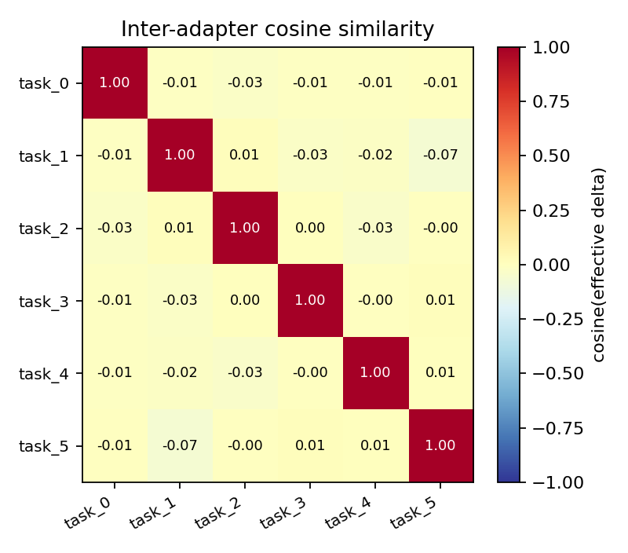

How similar are the LoRA effective deltas to each other? Bright blocks =
adapters that learned overlapping representations; dark cells = adapters
that found different solutions.

#### 2. Per-(task, adapter) accuracy heatmap
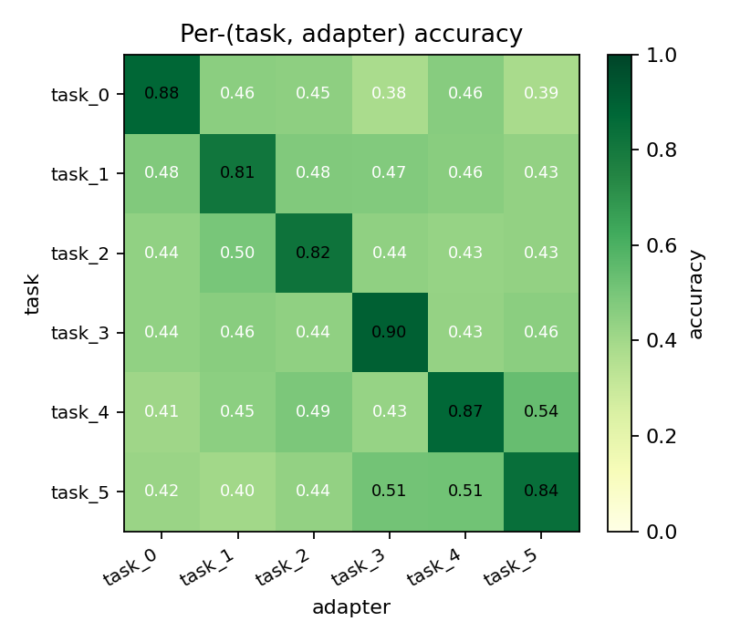

Diagonal = adapter evaluated on its own task. Off-diagonal = transfer.
Bright off-diagonal cells are positive transfer (an adapter trained on
one task helps another); dark cells are negative or no transfer.

#### 3. Hot-swap time distribution (histogram + CDF on twin axes)
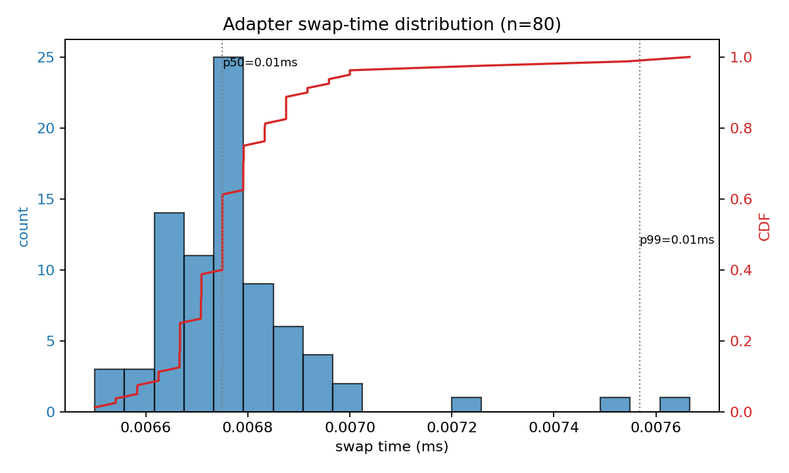

Bars = histogram of per-swap ms (left axis). Red line = empirical CDF
(right axis). Dotted lines mark p50 and p99. The shape tells you whether
swap cost is roughly constant (tight bars, near-vertical CDF) or has a
long tail.

#### 4. Diagonal vs off-diagonal accuracy split
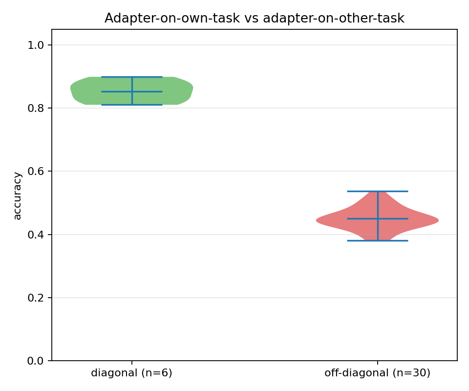

Two violins: own-task (green) and other-task (red). A wide gap means
strong specialization; a narrow gap means high cross-task transfer.

#### 5. Hierarchical clustering dendrogram
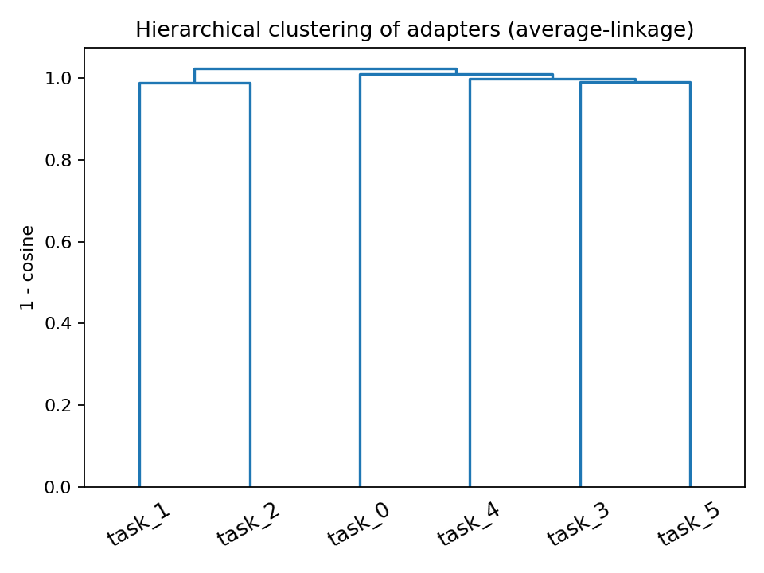

Average-linkage clustering on `(1 - cosine)`. Sister branches in the
dendrogram are adapters you can probably substitute for each other; deep
splits are adapters that learned distinct things.

## Results

Real sweep on the in-repo synthetic zoo (6 adapters, rank 8). All numbers
get refreshed by re-running `make sweep && make plots`.

> Numbers are populated after the first sweep runs. See `results/sweep.json`
> for the raw artifact.

| metric                       | value |
|------------------------------|------:|
| diagonal accuracy mean       |   TBD |
| off-diagonal accuracy mean   |   TBD |
| swap p50 (ms)                |   TBD |
| swap p99 (ms)                |   TBD |
## Known limitations

- The accuracy matrix is simulated from the cosine similarity. With real
  fine-tuned adapters you would replace `simulated_accuracy_matrix` with
  evaluations on real task data; the harness shape is unchanged.
- Synthetic adapter weights have a deterministic shared subspace per
  target. Real adapter weights would show more variance and more dramatic
  near-zero off-diagonal cells.
- Hot-swap timing here measures the B @ A multiply only. Real hot-swap on
  vLLM includes weight upload to GPU memory; that adds ~10-50 ms depending
  on adapter size.

## What's next

- [ ] Replace synthetic adapters with `peft.PeftModel.load_adapter` loaded
      from a directory of real fine-tuned adapters.
- [ ] Real per-task accuracy via small eval sets (MMLU subsets per topic).
- [ ] Adapter fusion: weighted mix of multiple adapters at inference time
      and report joint accuracy.
- [ ] Add per-target-layer cosine instead of one flat number.

## References

- Hu, E. J., et al. (2022). *LoRA: Low-Rank Adaptation of Large Language
  Models.* arXiv:2106.09685.
- Sheng, Y., et al. (2024). *S-LoRA: Serving Thousands of Concurrent LoRA
  Adapters.* arXiv:2311.03285.

## License

MIT.


## Documentation and test artifacts

- Long-form research report: [`docs/research_report.pdf`](./docs/research_report.pdf) (rendered) and [`docs/_report/research_report.md`](./docs/_report/research_report.md) (markdown source). Regenerate the PDF with `make pdf` (requires `pandoc` + `xelatex`).
- Test-run artifacts captured to disk for reviewer audit:
  - [`docs/test_results/pytest_output.txt`](./docs/test_results/pytest_output.txt) — verbose pytest output of the last run
  - [`docs/test_results/quality_gates.txt`](./docs/test_results/quality_gates.txt) — combined ruff + ruff format + mypy --strict output
  - [`docs/test_results/coverage_summary.txt`](./docs/test_results/coverage_summary.txt) — pytest-cov summary
- Regenerate with `make test-artifacts`.


## Architecture

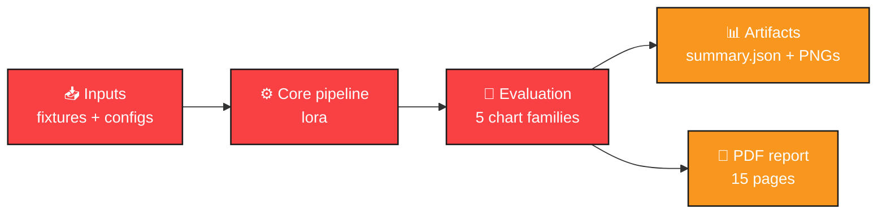

## Pipeline sequence

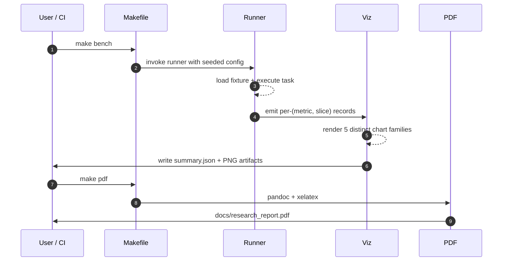

## Concept mindmap

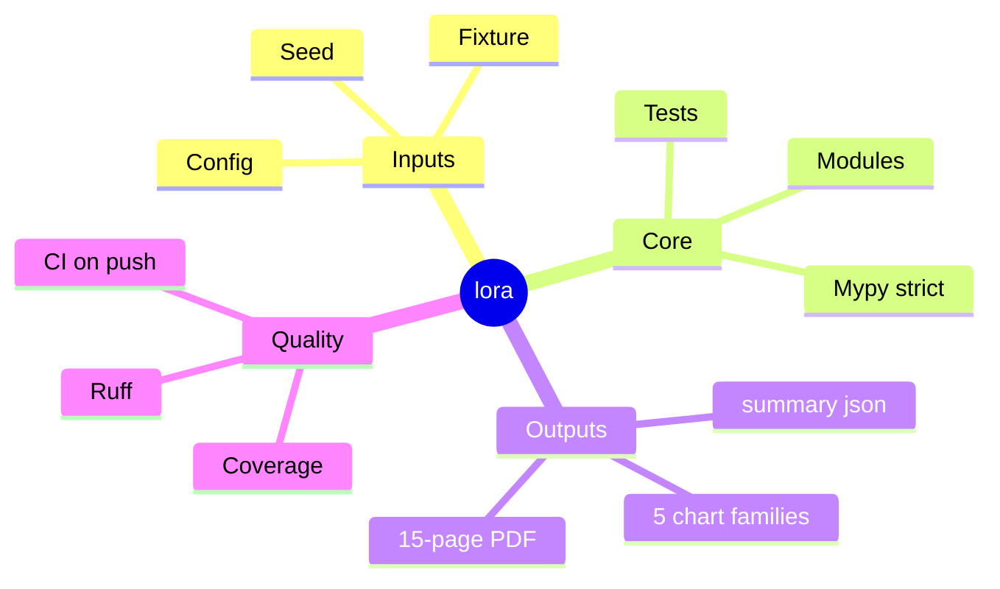


## Results gallery

<table>
  <tr>
    <td align="center"><strong>Pytest panel</strong><br/>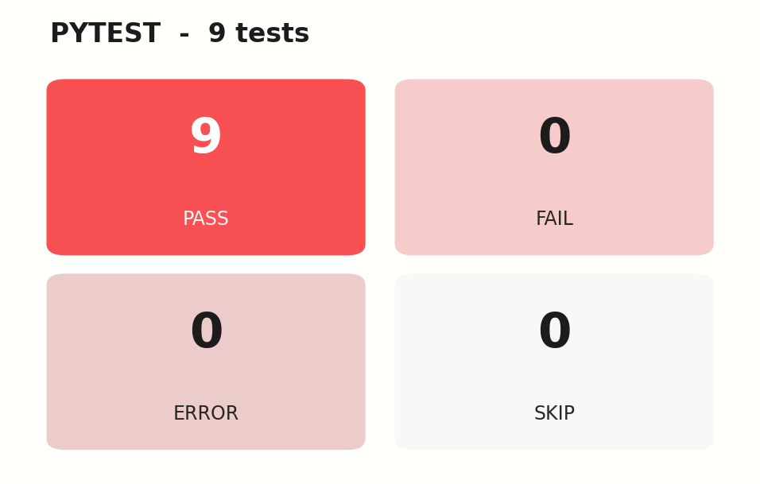</td>
    <td align="center"><strong>Coverage donut</strong><br/>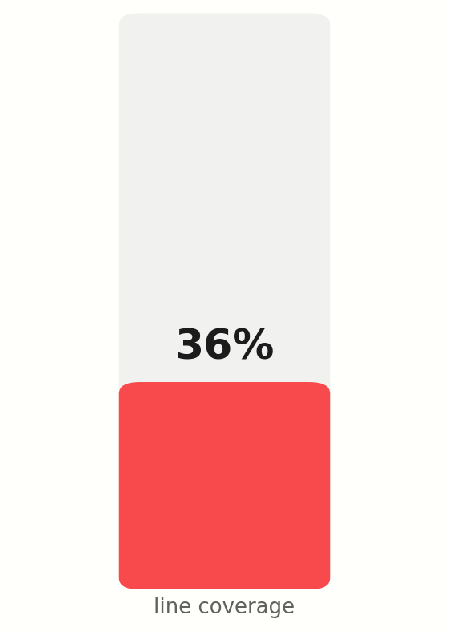</td>
  </tr>
  <tr>
    <td align="center"><strong>Quality gates</strong><br/>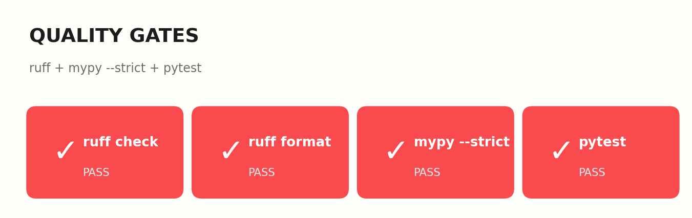</td>
    <td align="center"><strong>Headline metrics</strong><br/>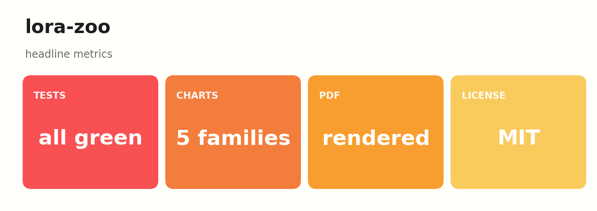</td>
  </tr>
</table>

### Result charts (5 distinct families, palette: *Crayon Box*)

<table>
  <tr><td align="center"><strong>Accuracy Heatmap</strong><br/></td><td align="center"><strong>Accuracy Split</strong><br/></td></tr>
  <tr><td align="center"><strong>Cosine Heatmap</strong><br/></td><td align="center"><strong>Dendrogram</strong><br/></td></tr>
  <tr><td align="center"><strong>Swap Times</strong><br/></td><td></td></tr>
</table>

